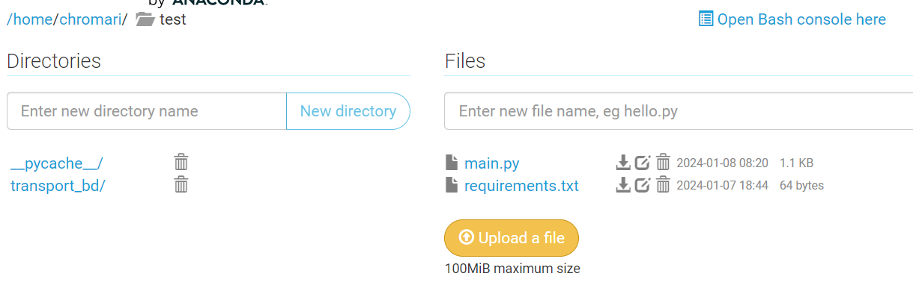
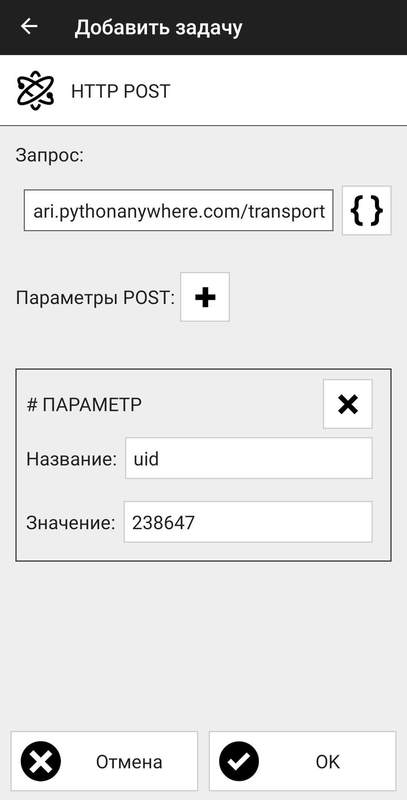

### Задание:

У нас есть NFC-метка. При помощи устройства (в нашем случае телефона) мы сканируем метку. При сканировании используется приложение NFC Tools PRO. Во время сканирования данные должны отправляться в базу данных на хранение (в нашем случае используется MySQL).

### Алгоритм реализации:

1. Создать базу данных. 
2. В созданной базе данных создать таблицу. В данную таблицу будут поступать данные с NFC-метки.
3. Выбрать поля для таблицы и их типы данных.
4. Реализовать API. Выбрать маршрут для POST запроса.
5. Реализовать connect к созданной базе данных.
6. Развернуть приложение на сервере в интернете.
7. Установить на телефон приложение NFC Tools API.
8. Добавить задачу, которая при сканировании будет делать http POST запрос.
9. Протестировать, что всё работает.

---
#### Ссылка на сайт: https://chromari.pythonanywhere.com/ (на данной странице отоброжается то, какие данные сейчас уже находятся в таблице)
---

### Создание базы данных в MySQL.

+ Сначала создаём базу данных, в которой будут в последствии находиться наши таблицы с данными.
+ Затем переключаемся на созданную нами базу данных.
+ Создаём таблицу с нужными нами полями:
    + **transport_id** - данное поле будет уникальным идентификатором для добавляющихся данных в таблицу. Данное поле будет само увеличивать своё значение на единицу при добавлении данных в него.
    + **uid** - уникальный номер транспортного средства под которым оно будет зафиксировано в базе данных. Имеет строковый тип (чтобы кодироаться не только числами, но и буквами)
    + **owner** - владелец транспортного средства / возможно тот кто производит сканирование. Строковый тип данных.
    + **now_data** - текущая дата. Это время когда произошло сканирование и данные были добавлены в базу данных.

[файл с кодом](transport-bd.sql)

### Реализация самого API при помощи Flask.

*Маршрут @app.route('/', methods=['GET']) используется для тестирования и понимания того, что добавление данных в таблицу работает исправно.*

+ **@app.route('/transport', methods=['POST'])** - по данной точке происходит получение данных, которые будут записаны в таблицу.
+ **@app.route('/', methods=['GET'])** - маршрут исключительно для проверки. Происходит запись данных или нет.

[файл с кодом](main.py)

### Реализация подключения к MySQL при помощи mysql.connector.

Все функции, которые используются для работы с базой данных находятся в папке **transport_bd**. Также каждая функция находится в своём файле.

Используем функцию, которая собирает общие данные необходимы для подключения к базе данных. Эта функция вызывается один раз при запуске приложения. Получает нужные данные (данные подключения на сайте сервера используются уже другие) и хранит их в переменной в основном файле *main.py*.

[файл с кодом](transport_bd/CONSTANTS.py)

Запрос, которой используется для получения всех данных из таблицы. Для подключения к базе данных используются полученные при старте приложения.
```sql
    SELECT * FROM transport;
```

[файл с кодом](transport_bd/select_all_table.py)

Запрос, который добавляет полученные через post данные в таблицу.
```sql
    INSERT INTO transport (uid, owner, now_data) VALUES(_, _, _);
```

[файл с кодом](transport_bd/write_sql_information.py)

### Размещение кода на pythonanywhere.


Данный сайт позволил развернуть приложение, чтобы протестировать, что всё исправно работает. Увы, на бесплатном тарифе локально подключиться к базе данных сайта нельзя. Но код, который отправлен на сайте и запускается на нём позволяет спокойно взаимодействовать с базой данных.

+ Создание базы данных прямо на сайте. Код использовался тот же самый, что и при создание локальной базы данных.
+ Получение данных для подключения к базе данных. Внесение их в код приложения для успешного подключения.
+ Залить папку проекта на данный сайт.
+ По инструкции развернуть проект на сайте и протестировать, что он работает исправно.



### Добавление задачи на NFC-метку.

+ В приложение NFC Tools PRO переходим в раздел "Добавить задачу".
+ Находим через поиск пункт "HTTP POST".
+ Добавляем наш API-адрес и параметры POST запроса, которые ожидает получить приложение.
+ После сохраняем созданную задачу и записываем её на NFC-метку.
+ NFC Tasks потребовалось дополнительно установить ещё одно приложение, чтобы NFC-метка начала отправлять запросы.

Теперь при поднесении метки к телефону с включённым NFC, происходит отправка на API-адрес.


